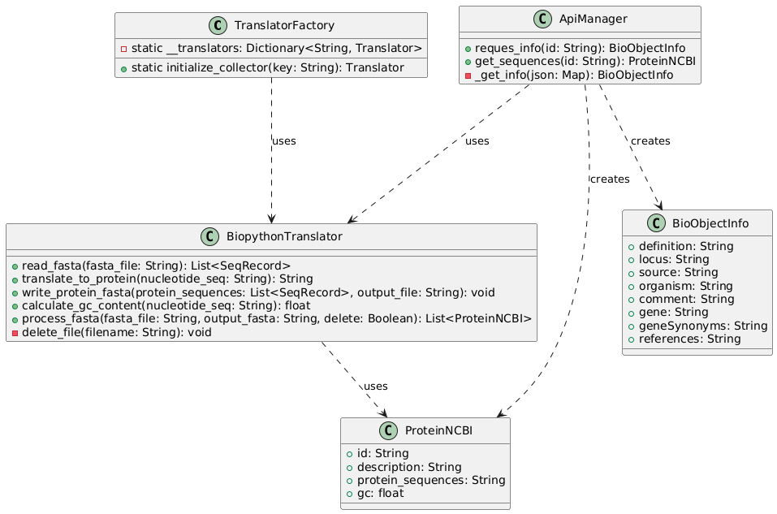
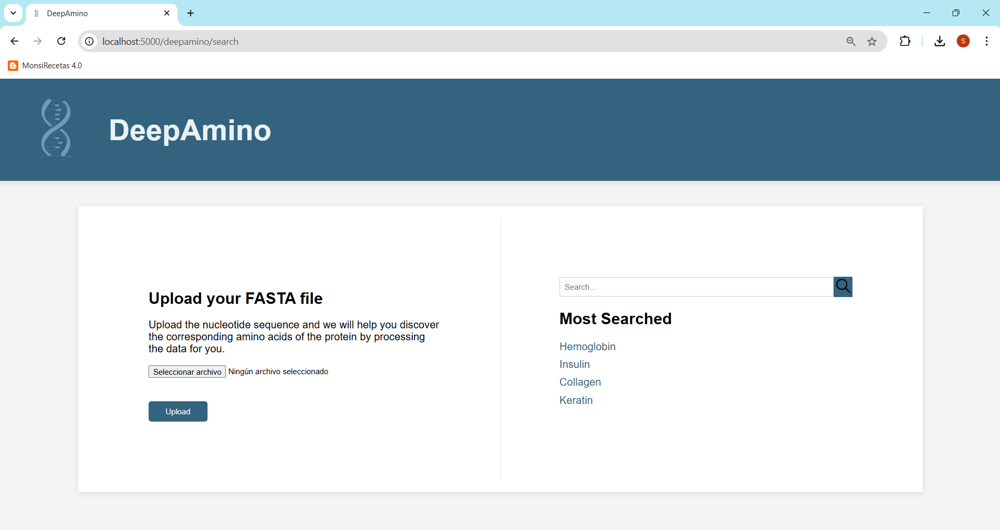
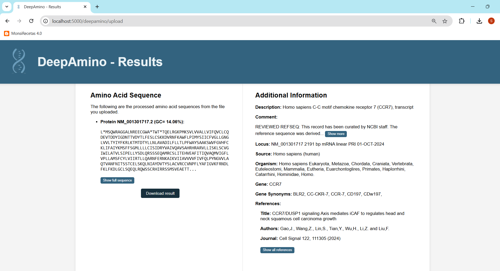
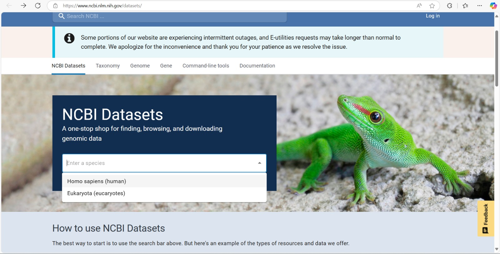
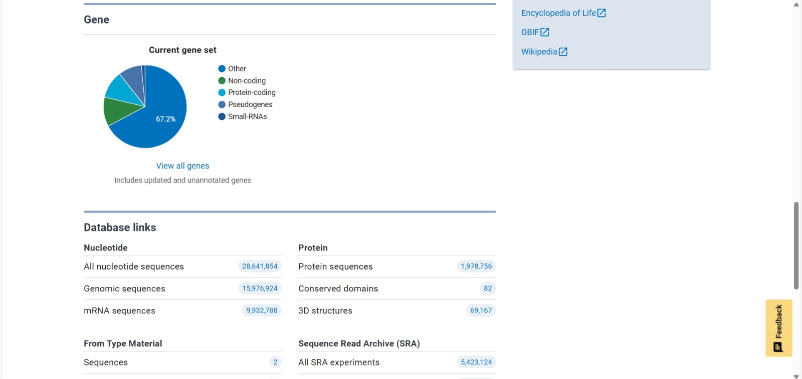
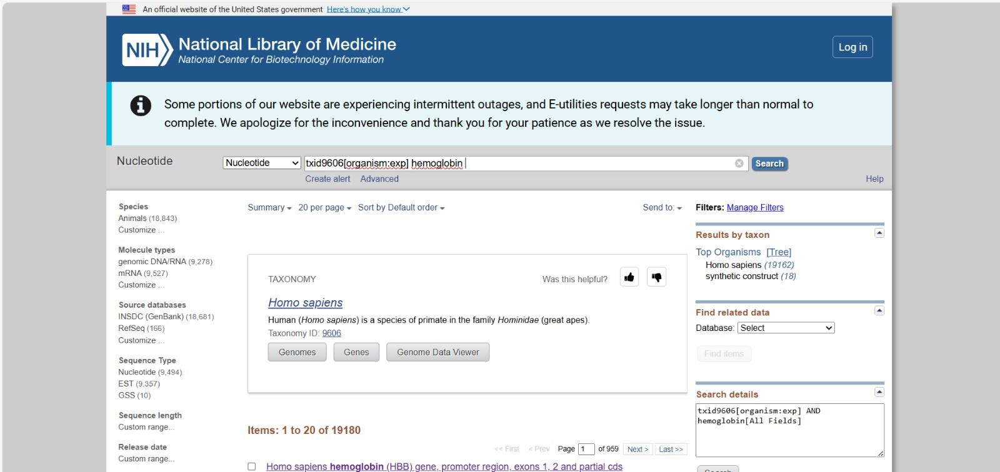
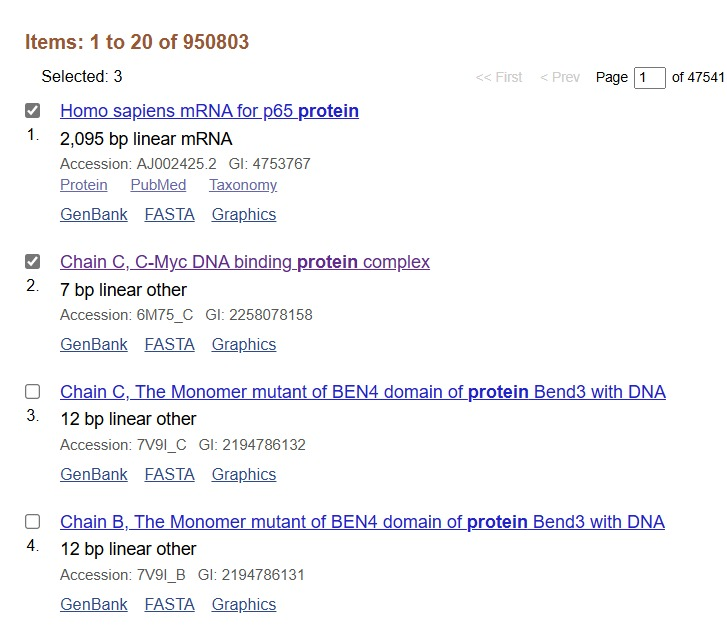
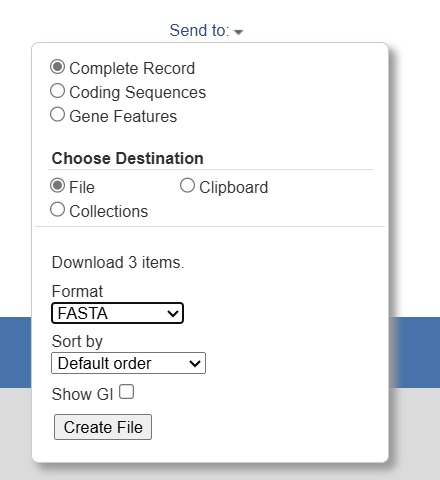

# Práctica 1: Operatividad con Biopython

**Participantes:**
- Ricardo Juan Cárdenes Pérez
- Susana Suárez Mendoza

Esta práctica consiste en la elaboración de un programa en Python que tome como entrada un fichero FASTA, con varias secuencias de ADN, que haga las siguientes operaciones:

- Calcular el porcentaje de nucleótidos **GC** en cada secuencia y lo muestre por pantalla
- Producir las cadenas de **aminoácidos** asociadas a **cada secuencia** de ADN
- Escribir estas secuencias de aminoácidos en otro **fichero FASTA** con los mismo identificadores que las secuencias de ADN

## 1. Implementación

Todo lo mencionado previamente ha sido implementado, incluyendo una interfaz de usuario accesible a través de una página web desarrollada con la librería `Flask` de Python. A continuación, se describen los diferentes módulos y componentes que conforman el proyecto.
- `/uploads`: este directorio almacena temporalmente los archivos FASTA que el usuario carga en la página web para su traducción de nucleótidos a aminoácidos. Una vez completada la traducción, los archivos FASTA son eliminados. Además, contiene cuatro archivos que no se eliminan, los cuales corresponden a las cuatro proteínas más frecuentes en el apartado de "Most Searched".
- `/results`: este directorio almacena los archivos FASTA que han sido traducidos a secuencias de aminoácidos, permitiendo al usuario descargarlos para su uso. Una vez que el usuario realiza la descarga, los archivos son eliminados permanentemente de este directorio.
- `/web_files/process`: este módulo implementa la lógica necesaria para traducir secuencias de nucleótidos a aminoácidos, calcular el porcentaje de contenido de GC y gestionar la obtención de información de proteínas mediante una API desarrollada en un módulo complementario en Java.
  - `/translate_factory.py`:La clase `TranslatorFactory` es una fábrica que, a partir de una clave específica (`key`), devuelve una instancia del traductor correspondiente, como `BiopythonTranslator`, y lanza un error si la clave no es válida.
  - `/biopython_translator.py`: La clase `BiopythonTranslator` facilita la lectura de archivos FASTA, traduce secuencias de nucleótidos a proteínas, calcula el contenido de GC, escribe secuencias de proteínas en formato FASTA, y permite eliminar archivos de manera opcional, gestionando errores en cada etapa del proceso.
  - `/protein_ncbi.py`:La clase `ProteinNCBI` representa una proteína con sus atributos principales, que incluyen un identificador (`id`), una descripción, la secuencia de aminoácidos (`protein_sequences`), y el contenido de GC (`gc`).
  - `/bio_object_info.py`: La clase `BioObjectInfo` encapsula información biológica clave, como definición, locus, fuente, organismo, comentario, gen, sinónimos de gen y referencias, y proporciona métodos `set_` para establecer cada uno de estos atributos.
  - `/api_manager.py`: La clase `ApiManager` facilita la interacción con una API externa para obtener información biológica y secuencias de proteínas mediante peticiones HTTP, procesando la respuesta en objetos de las clases `BioObjectInfo` y `ProteinNCBI`, y traduce secuencias de nucleótidos a proteínas con cálculo de GC usando `BiopythonTranslator`.

<div align="center">
    
      <p><strong>Figura 1.</strong> Diagrama de clases para el módulo "process".</p> 
  </div>

- `/web_files/static`: este directorio contiene las imágenes y hojas de estilo CSS utilizadas para el diseño de la página web.
- `/web_files/templates`: este directorio contiene archivos HTML que sirven como estructuras base para las páginas del sitio.
- `/web_files/web_service.py`: este archivo inicializa la aplicación web en Flask que permite la búsqueda, procesamiento y descarga de información sobre proteínas a partir de términos de búsqueda o archivos .fasta, utilizando una interfaz de usuario y varios servicios de API para gestionar y presentar datos relacionados con secuencias de proteínas.

## 2. Descripción de la Interfaz de Usuario

En este apartado se mostrarán las dos páginas disponibles de la web. 

Por un lado, la Figura 2 muestra una interfaz de usuario web de una aplicación llamada **DeepAmino**. En la parte superior, hay un encabezado con el nombre de la aplicación y un ícono de ADN.

La página está dividida en dos secciones:

1. **Izquierda**: Hay un cuadro de subida de archivos con el título "Upload your FASTA file". Este cuadro permite al usuario cargar un archivo en formato FASTA, que contiene secuencias de nucleótidos o aminoácidos. Debajo de la instrucción hay un botón para seleccionar el archivo y otro botón de "Upload" para cargarlo en la aplicación.

2. **Derecha**: Un cuadro de búsqueda con un campo de texto para que el usuario ingrese un término, el cual debe ser el identificador correspndiente a la base de datos del *National Center for Biotechnology Information* y un botón de búsqueda a la derecha. Debajo, hay una sección titulada "Most Searched" que muestra enlaces a proteínas populares como *Hemoglobin*, *Insulin*, *Collagen*, y *Keratin*.
   - Hemoglobina: protreína que transporta oxígeno desde los pulmones hacia los tejidos del cuerpo y ayuda a llevar dióxido de carbono de vuelta a los pulmones para su eliminación.
   - Insulina: proteína que ayuda a regular los niveles de glucosa en la sangre, permitiendo que las células absorban la glucosa para usarla como energía.
   - Colágeno: proteína que proporciona estructura, resistencia y elasticidad a tejidos como la piel, los huesos, los tendones y los ligamentos.
   - Queratina: proteína que protege y fortalece estructuras como el cabello, las uñas y la piel, aportándoles resistencia y durabilidad.

<div align="center">
    
      <p><strong>Figura 2.</strong> Página principal de la web.</p> 
  </div>

Por otro lado, la Figura 3 muestra la interfaz de resultados de la aplicación **DeepAmino**. La pantalla está dividida en dos secciones principales:

1. **Izquierda - Amino Acid Sequence**: Esta sección contiene el encabezado "Amino Acid Sequence" y presenta la secuencia de aminoácidos procesada a partir de un archivo que el usuario subió. Se muestra un identificador de la proteína (por ejemplo, "Protein NM_001301717.2") junto con el porcentaje de GC (contenido de guanina y citosina). Debajo, hay una secuencia larga de aminoácidos. También hay un botón para "Show full sequence" (Mostrar secuencia completa) y otro para "Download result" (Descargar resultado).

2. **Derecha - Additional Information**: Esta sección, titulada "Additional Information," muestra información detallada sobre la proteína, incluyendo:
   - **Description**: una breve descripción de la proteína (en este caso, el receptor de quimiocinas CCR7 en humanos).
   - **Comment**: un comentario que menciona la curación de la información en la base de datos NCBI.
   - **Locus**: el código específico y fecha de la referencia.
   - **Source** y **Organism**: la fuente y el organismo (humanos, en este caso) al que pertenece la proteína.
   - **Gene** y **Gene Synonyms**: el nombre del gen y sus sinónimos.
   - **References**: referencias bibliográficas relevantes, con detalles como título, autores, y la fuente del artículo.

Hay botones como "Show more" para expandir la información y "Show all references" para ver todas las referencias. En conjunto, esta página facilita tanto la visualización de la secuencia de aminoácidos como el acceso a información contextual y bibliográfica sobre la proteína.

<div align="center">
    
      <p><strong>Figura 3.</strong> Página de resultados.</p> 
  </div>

## 3. Dependencias

Para la ejecución de la aplicación, se han utilizado las siguientes bibliotecas externas:

- **Flask**: empleada para el desarrollo de la interfaz web, permitiendo la creación de rutas y la gestión de la interacción con el usuario a través del navegador.
- **Biopython**: utilizada para el procesamiento y análisis de secuencias de nucleótidos, incluyendo la conversión de secuencias de ADN a aminoácidos.
- **Requests**: encargada de realizar las solicitudes HTTP a la API de manera interna, facilitando la obtención de información adicional sobre las proteínas.

Estas bibliotecas deben estar instaladas para garantizar el correcto funcionamiento de la aplicación.

## 4. Instrucciones de Ejecución

Para iniciar la aplicación, es necesario ejecutar primero el módulo API en Java, el cual se encuentra en la rama `dev_scrapping` de este repositorio. Posteriormente, debe ejecutarse el archivo `web_service.py`, que inicializa la página web.

Las rutas disponibles en la página web son las siguientes:

- `http://localhost:5000/deepamino/search`: dirige a la página principal.
- `http://localhost:5000/deepamino/process_search`: procesa el identificador introducido en la barra de búsqueda y redirige a la página de resultados.
- `http://localhost:5000/deepamino/process_most_search`: procesa los archivos más buscados, almacenados en la aplicación para facilitar el acceso, y redirige a la página de resultados.
- `http://localhost:5000/deepamino/upload`: maneja la lógica de carga de archivos y redirige a la página de resultados.
- `http://localhost:5000/deepamino/results`: muestra los resultados generados a partir de las diferentes formas del `index.html`.
- `http://localhost:5000/deepamino/download/<filename>`: ejecuta la descarga del archivo resultante. 

Estas rutas permiten navegar y operar la aplicación web, proporcionando funcionalidades de búsqueda, procesamiento y descarga de archivos de secuencias de proteínas.


## 5. Posibles Mejoras y Trabajo Futuro

Este apartado puede incluir ideas para mejorar la aplicación, como:
- Soporte para otros tipos de archivos de secuencias.
- Integración con otras bases de datos de proteínas.
- Mejoras en la interfaz de usuario, como añadir opciones de filtrado en los resultados.
- Implementación de autenticación de usuario para gestionar cargas y descargas de archivos.


<br>

## A. Descarga de ficheros FASTA

Los ficheros FASTA utilizados en esta práctica se encuentran en la carpeta `uploads` del repositorio. Para descargarlos, se hace uso de la plataforma ofrecida por [NCBI](https://www.ncbi.nlm.nih.gov/datasets/), National Center for Biotechnology Information, a través de [NCBI Datasets](https://www.ncbi.nlm.nih.gov/datasets/). Si accede a esta última, verá la siguiente pantalla:

<div align="center">
    
      <p><strong>Figura 4.</strong> Página de NCBI Datasets.</p> 
  </div>

  Llegados a este punto, podemos especificar el término de búsqueda deseado. En nuestro caso, introduciremos `Homo sapiens (human)`, con el objetivo de encontrar secuencias de nucleótidos asociadas a proteínas humanas. Esto nos llevará a una página que contendrá información relevante sobre el contenido que NCBI posee del organismo en cuestión, tal y como se muestra en la Figura 5.

<div align="center">
    
      <p><strong>Figura 5.</strong> Página de resultados</p>
  </div>

  Podemos ahora hacer click en el número que se muestra al lado de `All nucleotide sequences`, lo que nos llevará a una página que permita buscar las distintas secuencias de nucleotidos del organismo. En la parte superior, tal y como se muestra en la Figura 6, podemos especificar qué tipo de secuencias queremos buscar, como por ejemplo la secuencia que codifica para una proteína, como podría ser el caso de la hemoglobina.

<div align="center">
    
      <p><strong>Figura 6.</strong> Página de búsqueda de secuencias de proteínas.</p>
  </div>

  Al pinchar en buscar, podemos ver una lista de secuencias de nucleótidos relacionadas con lo buscado. Si pinchamos en alguna de ellas, se nos redirigirá a una página con información detallada sobre la secuencia, donde se nos permita descargar el fichero en formato FASTA. No obstante, también es posible hacer click en los checkboxes de las secuencias que nos interesen y, posteriormente, descargar un único fichero FASTA que contenga todas las secuencias seleccionadas.

<div align="center">
    
      <p><strong>Figura 7.</strong> Selección de varias secuencias</p>
  </div>

  Finalmente, abajo del todo en el apartado `Send to`, podemos descargar el fichero FASTA mencionado, tal y como se muestra en la Figura 8. Basta para ello seleccionar el formato del fichero y clicar en `Create File`.

<div align="center">
    
      <p><strong>Figura 8.</strong> Descarga de fichero FASTA</p>
  </div>

  Si introducimos el siguiente prompt en la barra de búsqueda en la base de datos de nucleotidos, podemos descargar el fichero FASTA que contiene la secuencia de nucleótidos codificadoras de la hemoglobina, insulina, colágeno y queratina:

  ```bash
  txid9606[organism:exp] AND (
    AH002813.2[All Fields] OR 
    AJ009655.1[All Fields] OR 
    DQ659148.1[All Fields] OR 
    J00124.1[All Fields]
  ) 
  ```

  Donde se han buscado las secuencias de nucleótidos haciendo uso de sus identificadores. El resultado será una pantalla similar a la de la Figura 7, donde podemos seleccionar todas las proteínas y descargarlas en un único fichero FASTA, en `Send to`.

<div align="center">
    
      <p><strong>Figura 9.</strong> Descarga de fichero FASTA con las secuencias de nucleótidos de las proteínas más buscadas.</p>
  </div>

  El fichero FASTA final se encuentra en la carpeta [uploads](uploads/global.fasta) de este repositorio, y tiene la siguiente estructura:

  ```bash
  >J00124.1 Homo sapiens 50 kDa type I epidermal keratin gene, complete cds
CCCAGGGTCCGATGGGAAAGTGTAGCCTGCAGGCCCACACCTCCCCCTGTGAATCACGCCTGGCGGGACA
...

>AH002813.2 Homo sapiens alpha-1 type II collagen (COL2A1) gene, partial cds
CGCAGAGCGCTGCTGGGCTGCCGGGTCTCCCGCTTCCTCCTCCTGCTCCAAGGGCCTCCTGCATGAGGGC
...

>AJ009655.1 Homo sapiens ins gene, partial
AGCAGGTCTGTTCCAAGGGCCTTTGCGTCAGGTGGGCTCAGGGTTCCAGGGTGGCTGGACCCCAGGCCCC
...

>DQ659148.1 Homo sapiens hemoglobin (HBB) gene, promoter region, exons 1, 2 and partial cds
GGCATGAAAGTCAGGGCAGAGCCATCTATTGCTTACATTTGCTTCTGACACAACTGTGTTCACTAGCAAC
...
```
